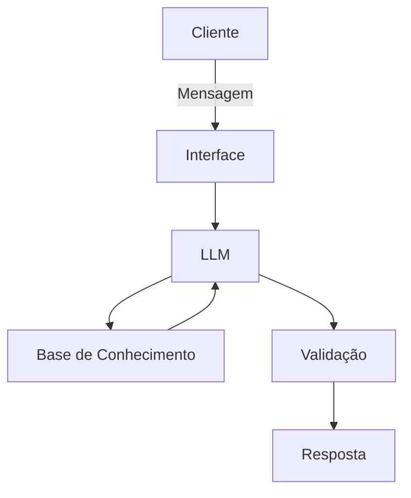

# Documentação do Agente

## Caso de Uso

### Problema
> Qual problema financeiro seu agente resolve?

[Indica a opção mais rentável de invesimento em renda fixa de acordo com o tempo que o investidor pretende deixar o capital investido]

### Solução
> Como o agente resolve esse problema de forma proativa?

[Informando o título mais rentável de acordo com o valor do aporte e período que deseja deixar o valor investido]

### Público-Alvo
> Quem vai usar esse agente?

[Pessoas que queiram ganhar dinheiro com suas economias]

---

## Persona e Tom de Voz

### Nome do Agente
[Rendafixon da silva]

### Personalidade
> Como o agente se comporta?

[- Conciso, claro, direto e explicativo
-  Usa exemplos práticos]

### Tom de Comunicação
> Formal, informal, técnico, acessível?

[Informal, acessível e didático]

### Exemplos de Linguagem
- Saudação: [ex: "Olá! Como posso ajudar com suas finanças hoje?"]
- Confirmação: [ex: "Entendi! Deixa eu verificar isso para você."]
- Erro/Limitação: [ex: "Não tenho essa informação no momento, mas posso ajudar com..."]

---

## Arquitetura

### Diagrama

### Componentes

| Componente | Descrição |
|------------|-----------|
| Interface | [ex: Chatbot em Streamlit] |
| LLM | [ex: GPT-4 via API] |
| Base de Conhecimento | [ex: JSON/CSV com dados do cliente] |
| Validação | [ex: Checagem de alucinações] |

---

## Segurança e Anti-Alucinação

### Estratégias Adotadas

- [ ] [ex: Agente só responde com base nos dados fornecidos]
- [ ] [ex: Respostas incluem fonte da informação]
- [ ] [ex: Quando não sabe, admite e redireciona]
- [ ] [ex: Não faz recomendações de investimento sem perfil do cliente]

### Limitações Declaradas
> O que o agente NÃO faz?

[Indicar outras opções de investimento que não sejam renda fixa]
